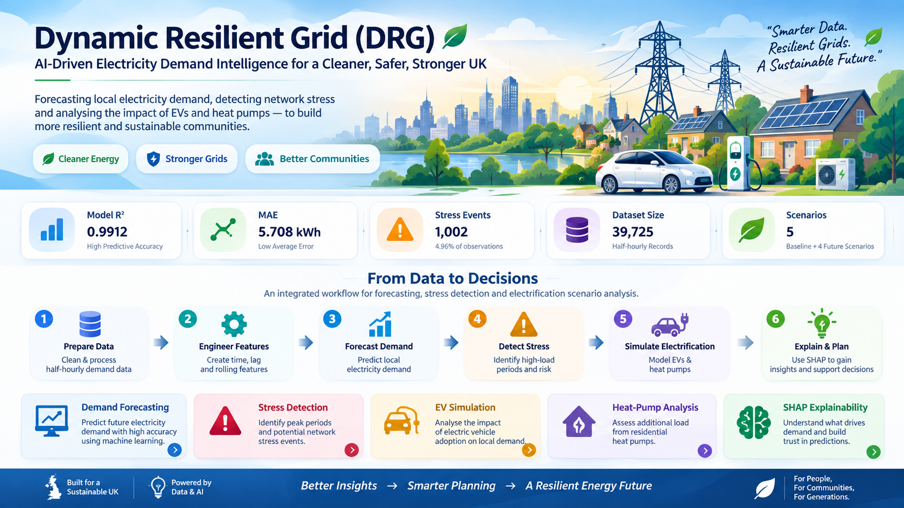
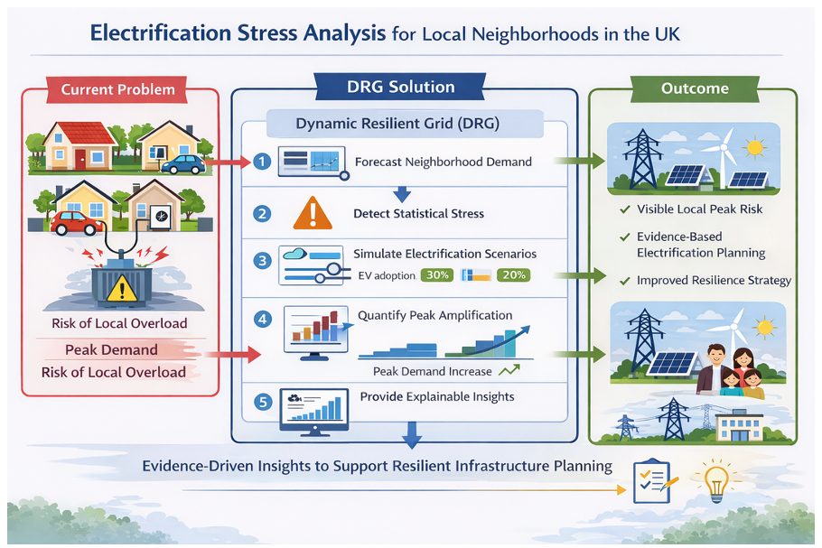
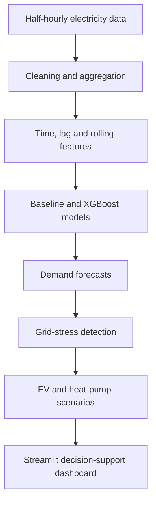

<p align="center">
  
</p>

# Dynamic Resilient Grid (DRG)

An AI-enabled decision-support system for forecasting local electricity demand and assessing how electric-vehicle charging and heat-pump adoption may affect UK urban electricity networks.

Developed as an MSc Data Science dissertation project at Kingston University, DRG combines time-series feature engineering, XGBoost forecasting, electrification stress simulation, SHAP-based explainability and an interactive Streamlit dashboard.

## Project highlights

- Forecasts half-hourly local electricity demand using an XGBoost regression model.
- Compares the final model against a Linear Regression baseline.
- Detects demand periods above a defined grid-stress threshold.
- Simulates EV, heat-pump and combined electrification scenarios.
- Explains forecast drivers through feature importance and SHAP analysis.
- Presents results in an interactive multi-page Streamlit dashboard.

## Model performance

The test-set results stored in this repository are:

| Model | MAE (kWh) | RMSE (kWh) | R² |
|---|---:|---:|---:|
| Linear Regression | 10.7455 | 13.7777 | 0.9713 |
| XGBoost | **5.7080** | **7.6328** | **0.9912** |

The XGBoost model reduced MAE by approximately 46.9% and RMSE by approximately 44.6% compared with the baseline.

> These figures describe performance on the project's held-out test data. They are not claims about all UK electricity networks.

## Stress-analysis findings

A stress event is recorded when simulated half-hourly demand exceeds the project threshold of **354.5756 kWh**.

| Scenario | Additional evening load | Stress events | Stress rate |
|---|---:|---:|---:|
| Baseline | 0 kWh | 1,016 | 5.00% |
| Low combined | 20 kWh EV + 10 kWh heat pump | 1,624 | 8.00% |
| Medium combined | 40 kWh EV + 20 kWh heat pump | 2,032 | 10.01% |
| High combined | 60 kWh EV + 30 kWh heat pump | 2,346 | 11.55% |
| Extreme combined | 80 kWh EV + 40 kWh heat pump | 2,642 | 13.01% |

These scenarios are analytical stress tests, not direct predictions of future adoption or network failure.

## Dashboard

<p align="center">
  
</p>

The Streamlit application contains the following views:

1. Home
2. Data overview
3. Demand forecasting
4. Stress detection
5. EV simulation
6. Heat-pump simulation
7. Combined EV and heat-pump simulation
8. SHAP explainability
9. Model performance and summary

## Technical workflow



### Main features

- Calendar features: hour, day, month, weekday, weekend and season
- Lag features: 1, 48 and 96 half-hour intervals
- Rolling features: 48-period mean and standard deviation
- Explainability: feature importance and SHAP analysis

## Data sources

The project uses publicly available or academically licensed data from:

- UK Data Service, Low Carbon London smart-meter dataset (Study 7857)
- Department for Transport electric-vehicle charging-device statistics
- Department for Energy Security and Net Zero heat-pump deployment statistics

Raw source data is not included in this repository. The smaller processed files required by the dashboard are included for reproducibility.

## Repository structure

```text
DRG_project/
├── dashboards/
│   ├── app.py
│   ├── assets/
│   └── requirements.txt
├── data/
│   └── processed/
├── models/
│   ├── feature_names.json
│   └── xgboost_demand_model.json
├── notebooks/
│   ├── 01_Data_Understanding.ipynb
│   ├── ...
│   └── 13_Project_Enhancements.ipynb
├── outputs/
│   ├── figures/
│   ├── models/
│   └── tables/
└── .gitignore
```

The numbered notebooks document the workflow from data understanding and cleaning through forecasting, simulation and explainability.

## Run the dashboard locally

### Requirements

- Python 3.10 or later
- Git

### Installation

```bash
git clone https://github.com/Tejasvi-Ponugoti/DRG_project.git
cd DRG_project
python -m venv .venv
```

Activate the environment:

**Windows PowerShell**

```powershell
.venv\Scripts\Activate.ps1
```

**macOS or Linux**

```bash
source .venv/bin/activate
```

Install dependencies and start the application:

```bash
pip install -r dashboards/requirements.txt
cd dashboards
streamlit run app.py
```

The dashboard will normally open at `http://localhost:8501`.

## Reproducibility notes

- The trained XGBoost model and ordered feature list are stored in `models/`.
- Dashboard-ready processed data is stored in `data/processed/`.
- Evaluation tables and figures are stored in `outputs/`.
- Run the dashboard from the `dashboards` directory because the application currently uses paths relative to that folder.
- The original large raw and intermediate datasets are excluded from version control.

## Responsible interpretation

DRG is a research prototype for scenario exploration and local planning support. Results depend on historical data, engineered features, the selected threshold and simplified evening-load assumptions. The tool should support—not replace—engineering studies, network measurements or operational decisions.

## Author

**Tejasvi Ponugoti**  
MSc Data Science, Kingston University  
Interested in data analytics, data engineering and applied machine learning opportunities in the UK.

[GitHub profile](https://github.com/Tejasvi-Ponugoti)
